# 🥤 마실까말까?

## 링크(모바일) : [drinkornot.kr](http://drinkornot.kr) 

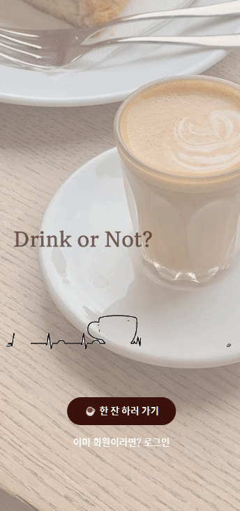

## 프로젝트 진행 기간

2023.01.09(월) ~ 2023.02.17(금)

SSAFY 8기 2학기 공통프로젝트

## 기획 배경

- 매일 매일 피곤함을 덜기 위해 카페에 찾아가는 우리들, 하지만 커피를 마실 때마다 건강 걱정을 하시지는 않나요?
- 이미 2잔을 마셔서 디카페인 음료를 마실지 고민하거나, 당을 과도하게 섭취한 것 같은데 또 마시고 싶어 고민하시지는 않나요?
- 저희 ‘마실까말까?’ 는 그러한 니즈를 충족시켜주기 위해 탄생한 **카페 음료 주문 및 섭취 관리 서비스**입니다.
- 카페 별로 음료 주문을 손쉽게 할 수 있고, 주문하면서 영양성분과 내 섭취량을 확인하여 음료를 선택할 수 있도록 도와줍니다.

## 개요

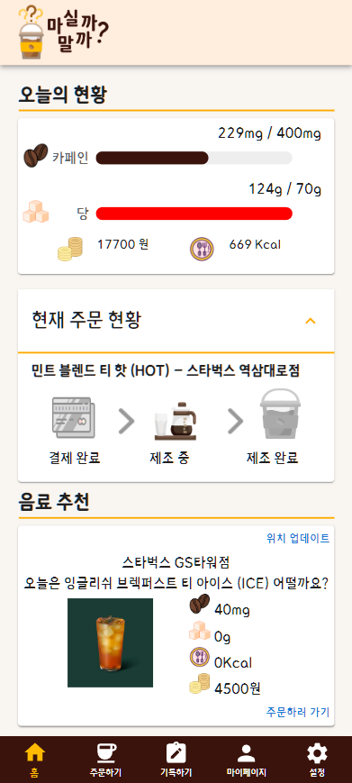

- 마실까말까?는 매일 매일 어떤 음료를 마셔야 하는지, 카페인이나 당을 지나치게 섭취하지는 않았는지 고민하는 우리의 모습을 표현하고 있습니다.
- 하루하루 카페인 및 당 섭취 제한을 위한 목표량을 세우고 이에 맞게 음료를 추천받아 주문합니다. 
- 주문하면 바로 기록으로 추가되어 매일 어떤 음료를 마셨는지, 카페인, 당, 칼로리 섭취량은 얼마나 되는지, 총 지출액은 얼마나 되는지 확인할 수 있습니다.

## 주요 기능

### 💰 주문

**주문 및 결제**
| 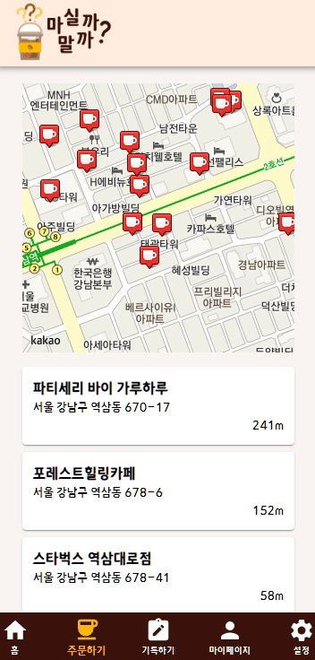  | 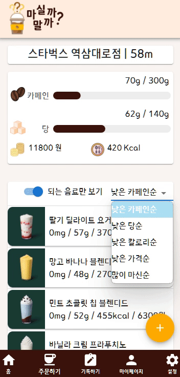|
| -- | -- | 

- 자신의 주변에 있는 카페 목록을 받아서 음료를 선택하고 주문할 수 있어요. 주문하면서 음료 영양성분을 확인하고, 선택한 음료를 마셨을 때 섭취 변화량을 확인할 수 있어요.

| 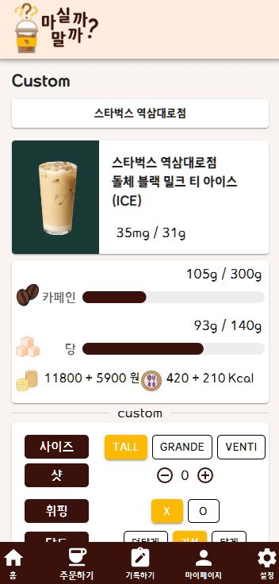| 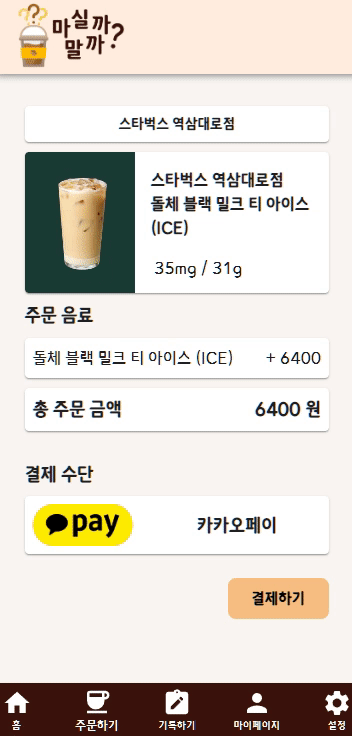 |
| -- | -- |

- 바로 카카오페이로 결제가 가능해요. 결제 후에는 해당 지점에게 주문이 전달돼요.  나의 메인 화면에서 주문상태의 변화를 실시간으로 확인 가능해요.

**주문과 기록의 연동** 

- 내가 따로 데이터를 기록하지 않아도 주문하면 바로 기록에 추가돼요.

### 👍 기록 및 추천
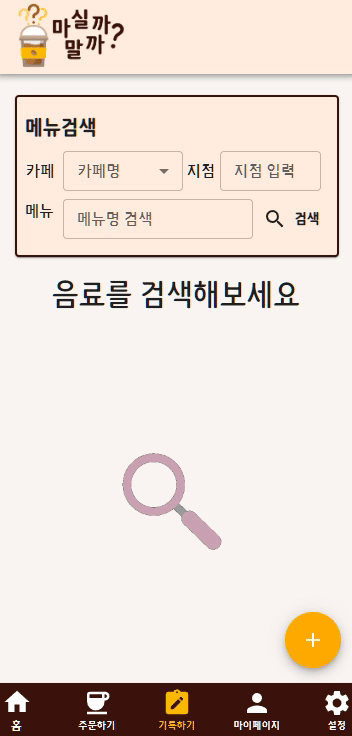
| 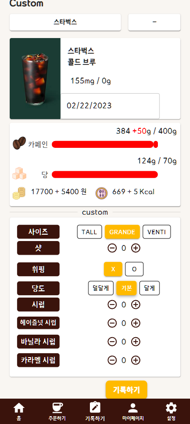 | 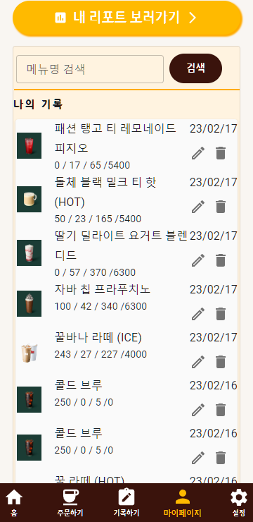 |
| -- | -- |

- 우리 서비스를 이용해서 주문하지 않았어도 나중에 카페를 검색해서 음료를 선택하고 기록에 추가할 수 있어요.
- 추가된 기록들은 마이페이지에서 확인 가능해요. 영양성분, 가격을 확인할 수 있고 사진이나 후기를 추가할 수 있어요.

| 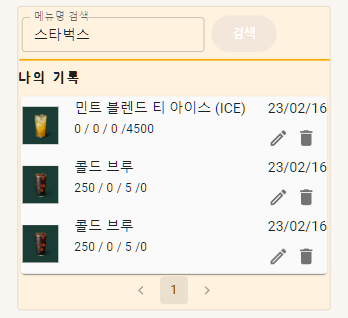 | 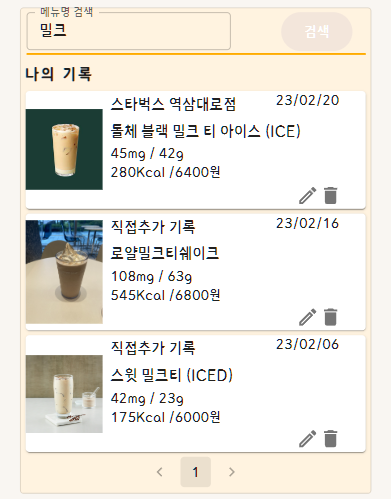 |
| -- | -- |

- 음료 이름이나 카페 이름으로 기록을 찾아볼 수 있어요.
- 기록에 남긴 데이터를 기반으로 매일 설정한 목표량을 초과하지 않는 음료를 추천받을 수 있어요.
- 음료 주문 화면에서도 내가 많이 마신 음료를 음료 목록 가장 위에서 확인할 수 있어요.

### 📊 리포트

| 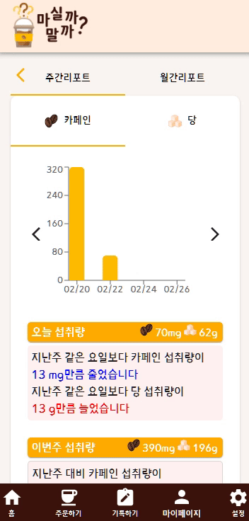 | 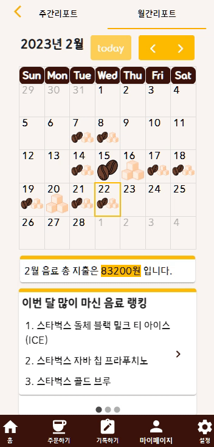 |
| -- | -- |

- 매일 카페인과 당 섭취 목표량을 설정할 수 있어요.
- 주간 리포트를 통해 이번 주 섭취량 및 지난 주 대비 변화량 확인이 가능해요.
- 월간리포트를 통해 설정한 목표량에 대한 각 날짜의 성공 여부를 확인할 수 있어요.
- 이번 달에 가장 많이 마신 음료 및 카페인, 당이 높은 음료 랭킹을 확인할 수 있어요.

## 디테일

[와이어프레임](https://www.figma.com/file/kxdgMKy7Vxj1RRPK8wGXq4/%EC%B9%B4%EB%8B%B9-%EB%A6%AC%EB%89%B4%EC%96%BC?t=ObaWwRQclMMKYZfJ-0)

[명세서](https://www.notion.so/3-1-7bcdf41067804c2dbc401e857ef0adc4)

[erd](https://www.erdcloud.com/d/RMHMvGSh9P6B2hRiX)

[API 명세서](https://www.notion.so/3-3-API-376a88be5d1244638107329c3f7b9161)

아키텍처

.png)

## **팀원 소개**

- 임소정(팀장): Frontend 개발
- 박세희(팀원): Frontend 개발
- 이소민(팀원): Frontend 개발
- 이윤경(팀원): Backend 개발
- 정재영(팀원): Backend 개발
- 지강훈(팀원): Backend 개발

## **기술 스택**

**Front-end**

- React 18.2.0
- Node.js 18.13.0
- Visual Studio Code
- sockjs-client: 1.6.1

**Back-end**

- java 11.0.17
- IntelliJ IDE
- Springboot 2.7.8
- Spring Data JPA
- Spring Security
- Spring Validation
- Spring Web
- Spring WebSocket
- Redis
- Swagger 3.0.0
- MySQL

**Infra**

- AWS EC2
- Docker
- Jenkins
- NGINX

## **협업 툴**

- Notion
- Figma
- Discord

